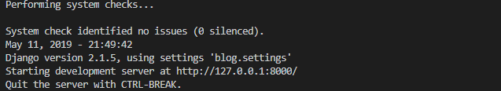
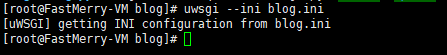
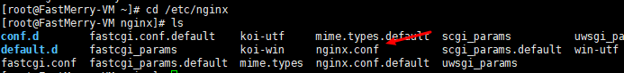

### 前言
以这个[Blog项目](<https://github.com/Playwi0/Blog>)为例，服务器部署Django，也是第一次在服务器部署Django。

---

### 环境选择

- Python 3.7.2

- Django==2.1.5
- Ngnix（无要求，最新便可）
- Uwsgi（无要求，最新便可）
- Centos 7.x

这次没有把项目运行在虚拟机（ virtualenv ）或其他进程管理工具，主要是服务配置太低，以及也就放自己的Blog，不会放其他的项目。

---

### 安装Python3

- centos7默认自带python2，所以先安装一下python3

- 先安装依赖

  - ```linux
    yum -y upgrade //update software package
    yum -y install gcc g++
    yum -y groupinstall "Development tools"
    yum -y install zlib-devel bzip2-devel openssl-devel ncurses-devel sqlite-devel readline-devel tk-devel gdbm-devel db4-devel libpcap-devel xz-devel
    ```

- 新建一个安装python3的文件夹并进入

  - ```linux
    mkdir /usr/local/python3
    cd /usr/local/python3
    ```

- 下载python3.7.2，解压，编译，安装

  - ```linux
    wget https://www.python.org/ftp/python/3.7.2/Python-3.7.2.tar.xz //download
    tar -xf  Python-3.7.2.tar.xz	//decompress
    cd Python-3.7.2 	//Entry directory
    ./configure --prefix=/usr/local/python3
    make && make install
    ```

- 重要一步，创建软链接，不创建用不了python3以及pip3这两个命令

  - ```linux
    ln -s /usr/local/python3/bin/python3 /usr/bin/python
    ln -s /usr/local/python3/bin/pip3 /usr/bin/pip3
    ```

- 上面执行完，就可以使用python3和pip3了

----

### 安装Django

- 直接使用命令安装Django，注意版本

  - ```python
    pip3 install Django==2.1.5		//Django version of blog project
    ```

- 安装Blog所需的模块

  - ```python
    pip3 install Django-taggit	//tags
    pip3 install Django-mdeditor	//editor
    pip3 install Markdown	//markdown Render
    pip3 install Pygments	//highlight code
    ```

- 安装Uwsgi

  - ```python
    pip3 install uwsgi
    ```

- 建立软链接

  - ```python
    ln -s /usr/local/python3/bin/uwsgi /usr/bin/uwsgi
    ```

- 回到根目录建立一个项目存放地址，顺便给予目录读写权限，方便管理。

  - ```linux
    mkdir -p /Blog/wwwroot/
    sudo chmod 777 /Blog/wwwroot/
    cd /Blog/wwwroot/
    ```

- 安装git，从远程仓库克隆代码到本地

  - ```linux
    yum –y install git
    git clone https://github.com/Playwi0/Blog.git
    ```

  

- 进入目录，测试django项目是否能运行

  - ```python
    cd Blog/blog/		#current directory /Blog/wwwroot/
    python3 manage.py runserver
    ```

- 出现下面代码则证明正常运行

  - 

- 确认没问题，ctrl+c停止项目，修改settings.py

  - ```linux
    cd blog			#parent directory /Blog/wwwroot/Blog/blog/
    vi settings.py
    ```

- 修改两处

  - ```python
    DEBUG = False 		#close debug 
    ALLOWED_HOSTS = ['*'] 	#allow all ip to access
    ```

- 保存退出

---

### 安装nginx

- 幸运的话，执行下面命令就可以安装

  - ```python
    yum install -y nginx
    ```

- 运气不好就先执行以下命令，安装nginx源

  - ```linux
    rpm -ivh http://nginx.org/packages/centos/7/noarch/RPMS/nginx-release-centos-7-0.el7.ngx.noarch.rpm
    yum install -y nginx 	//install nginx
    ```

- 到这，已经安装项目所需的全部环境

### 关闭系统干扰

- 如果是新生最好先暂时关闭防火墙，避免以下不必要的错误

  - ```linux
    sudo systemctl stop firewalld 	#close firewall temporarily
    sudo firewall-cmd --zone=public --add-port=80/tcp --permanent 	 #pen the required ports 
    sudo firewall-cmd --reload 		# reload firewall
    ```

- 将 SELinux 设置为宽容模式。

  - ```linux
    sudo setenforce 0
    ```

----

### 配置文件

- 进入到项目目录下面，创建uwsgi的ini文件，也就是和manage.py同一目录,

  - ```linux
    cd /Blog/wwwroot/Blog/blog/
    vi blog.ini 	#create blog.ini
    ```

- 在里面写入配置信息

  - ```linux
    [uwsgi]
    socket = 127.0.0.1:8090 	#nginx 
    #http = 127.0.0.1:8090 		#uwsgi
    chdir = /Blog/wwwroot/Blog/blog/	 	#Project root directory
    wsgi-file = wsgi.py		#
    module = blog.wsgi
    
    processes = 2
    threads = 4
    
    master =True
    pidfile = uwsgi.pid
    daemonize=uwsgi.log
    ```

  - uwsgi本身就封装http协议，可以直接设置http访问。如果是nginx就要设置socket，注释http，记得在项目目录创建uwsgi.pid，uwsgi.log，不创就删了最后两行

- 运行ini文件

  - ```linux
    uwsgi --ini blog.ini
    ```

- 出现以下代码说明运行正常

  -  

- 如果不想使用ini配置，uwsgi也支持xml，在这不赘述。

- 配置nginx文件，不知道文件在哪可以用以下命令查看

  - ```linux
    whereis nginx
    ```

- 我的是在 /etc/nginx目录下

  - ```linux
    vi /etc/nginx/nginx.conf
    ```

  - 

- 修改server部分

  - ```linux
    server {
            listen       80; 		#listening port
            server_name  _;			#your domain name or nothing
    
            # Load configuration files for the default server block.
            #include /etc/nginx/default.d/*.conf;
    
            location / {
                    uwsgi_pass 127.0.0.1:8090;		#same as uwsgi socket
                    include uwsgi_params;
            }
    
            location /static {
                    alias /Blog/wwwroot/Blog/blog/blogapp/static/; 	#static file
            }
    
            error_page 404 /404.html;
                location = /40x.html {
            }
    
            error_page 500 502 503 504 /50x.html;
                location = /50x.html {
            }
        }
    
    ```

- 保存，重启nginx即可

  - ```linux
    nginx -s reload
    ```

- 去访问你的blog吧

### 参考文章

- <https://www.centos.bz/2018/01/centos-7%EF%BC%8C%E4%BD%BF%E7%94%A8yum%E5%AE%89%E8%A3%85nginx/>
- <https://blog.csdn.net/weixin_43343144/article/details/86772507>
- <https://code.ziqiangxuetang.com/django/django-nginx-deploy.html>

