### 教程简介

- 本教程主要是在服务器部署成功之后使用

- 废话不多说，下面就是教程

----

### 修改管理员密码

- 不用解释，这肯定是部署好服务器之后第一个要做的。
- 本人并没有修改Django默认后台管理地址，你的ip后面加上**/admin**
- 登录管理员后台，默认账号为：**admin**，默认密码：**qwe123...**，成功会看到以下界面
  - 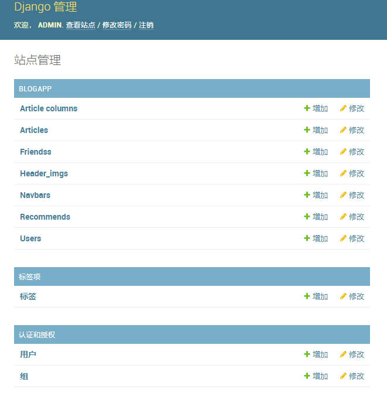
- 点击修改密码
  - 
- 按要求填信息，成功修改密码
  - 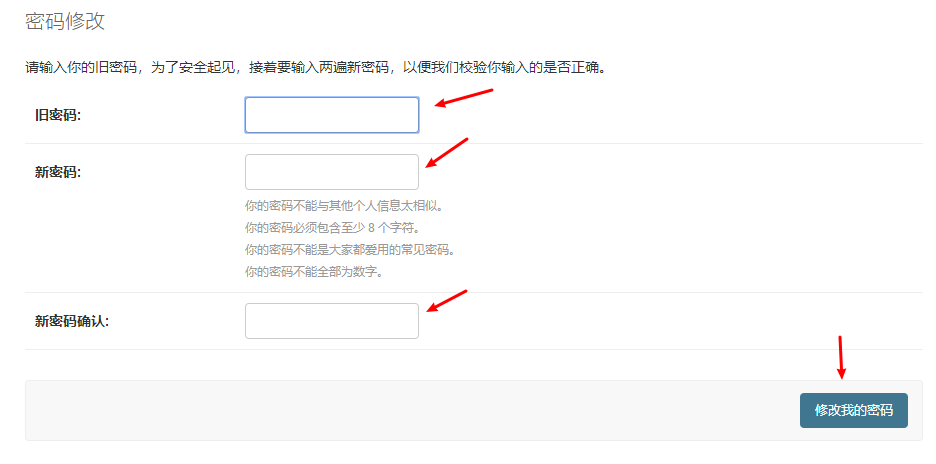
- 如果要修改管理员用户名，在管理员界面首页，点击用户
  - 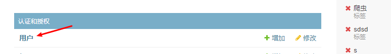
- 点击用户名
  - 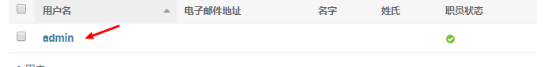
- 修改，点页面最下面保存
  - 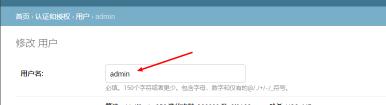
- 修改完成之后，以后登录管理员界面就是你修改的账号密码

---

### 数据库简介

- **Article columns** ：文章类名。
- **Articles**：博客文章
- **Friends**：友链信息
- **Header_imgs**：每个网页的顶部大图片
- **Navbars**：顶部导航栏，网页列表
- **Recommend**：博客首页轮播图的文章，默认设置五个
- **Users**：用户信息
- **标签**：保存文章标签的数据库。可以不管

下面介绍详细使用方法

----

### Navbars——顶部导航栏列表

- 进入**Navbars**数据库，里面默认设置了这个Blog demo的几个板块，如果有需要可自己修改添加页面
  - 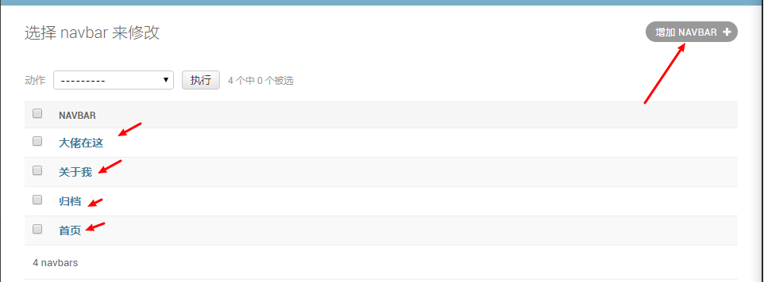
  - 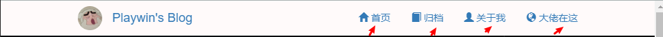
- **word img**是boostrap附带的字体图标，链接：<https://v3.bootcss.com/components/>，可以根据自己的需求修改
  - 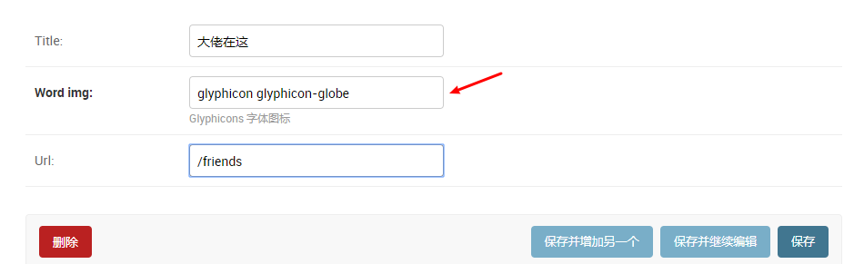
  - 
  - 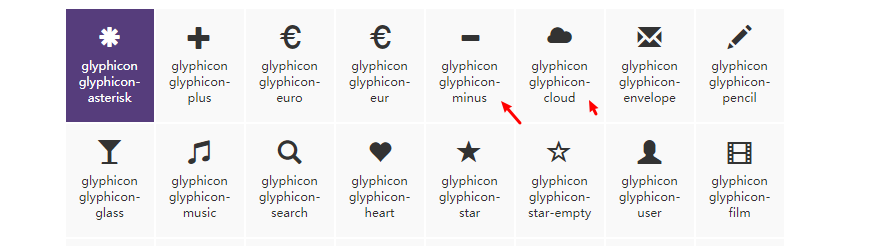

----

### Header_imgs——网页头部图片

- 我在每个板块都设置了一个头部图片。包括关于我，友链，归档。首页是轮播图，所以没有，下面会介绍轮播图更换
  - 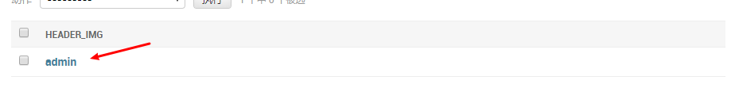
  - 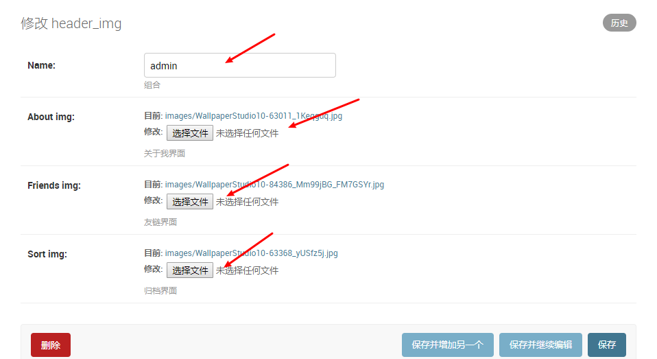

- admin是组名，默认只使用第一组的，所以添加多个也没啥用。
- 记得[图片压缩](<https://www.iloveimg.com/zh-cn/compress-image>)一下，减少服务器资源消耗，服务器性能好随意，图片记得选大一点的。

---

### Friends——友链

- 包含四个字段

  - name：名字或ID
  - Head img 头像
  - Motto：座右铭
  - Url：朋友链接，一定要加上http协议头
- 例子
  - 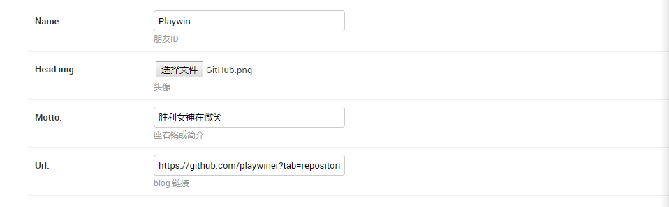

----

### Users——用户信息

- 包含八个字段

  - name：你的ID或名字，会显示到到导航栏左上角处，建议是用英文
    - 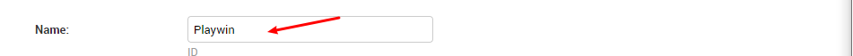
  - Head img ：头像，同意会显示到导航栏
    - 
  - Motto ：座右铭
  - Major：正在读书可以填专业，工作可以填职务
  - Github：你的github链接
  - Bili：你的bilibili链接
    - 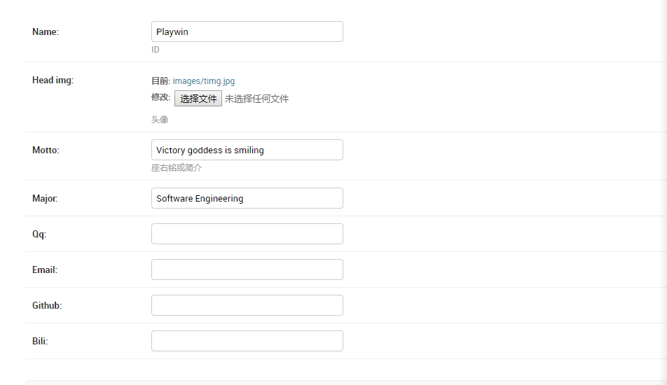

- 填写完这些信息会同步到**关于我**的板块
  - 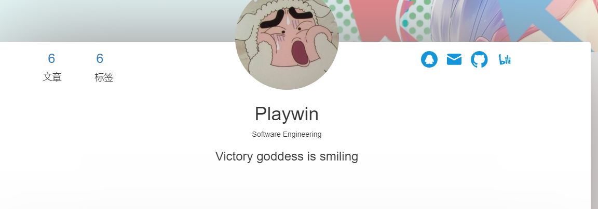

----

### Article——文章保存数据库

- 点击右上角增加按钮来增加文章，默认保留有五个文章，为什么，下面会提到
- 包括六个字段
  - Title：文章标题，不要太长
  - Img：文章标题图，会显示到首页文章列表背景图片，文章阅读时头部图片，归档时背景图片，如果该文章你设置为推荐文章，会是轮播图图片。还有就是尽量选择大图，不要太大，宽度，1920以上，高度950最佳（电脑不同最，效果可能不一样），超出无所谓，超太多会影响主页显示效果，可以在提到上面图片压缩地址进行压缩或裁剪。一定要统一图片大小
  - Column：是文章分类，可以选择，添加或删除可以在Column数据库设置。输入框旁边的小铅笔和+号也可以修改。
  - 标签：填写文章标签，以英文逗号相隔，中文会出错。列如Github,BLOG,Django
  - Introduction：文章简介，最多50个字左右，会显示到主页文章列表，以及归档
  - Conten：文章编辑器，支持markdown语法。
    - 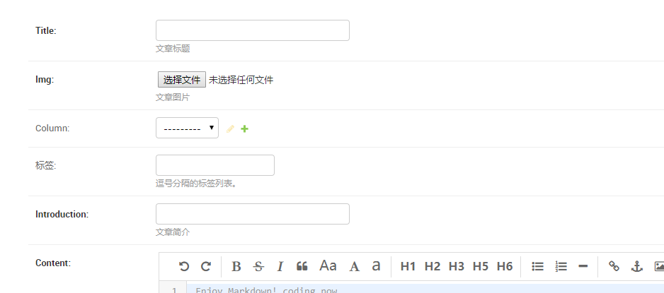

----

### Recommand——首页轮播图及文章

- 默认包含五个，因为首页轮播是用里的，直接点击修改就行。
- 字段为选择Article数据库中的文章作为轮播图文章，name需要手打，最好和你选择文章保持一致，便于修改
  - 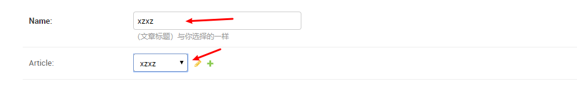
- 可以自己增加，但是如果要显示到首页的轮播图就要是前五个，或自己手动在html添加轮播图个数。

